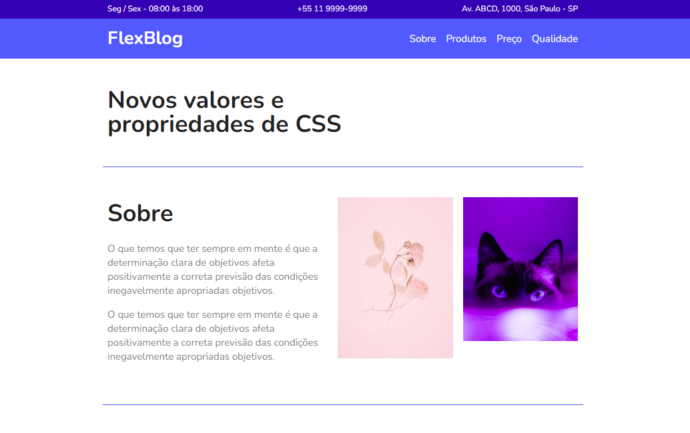

# CSS-Flexbox
Este projeto foi realizado durante o curso online da [Origamid](https://www.origamid.com/curso/css-flexbox/), onde foram abordadas as principais propriedades do Flexbox, permitindo a criação de layouts bem organizados e responsivos.

